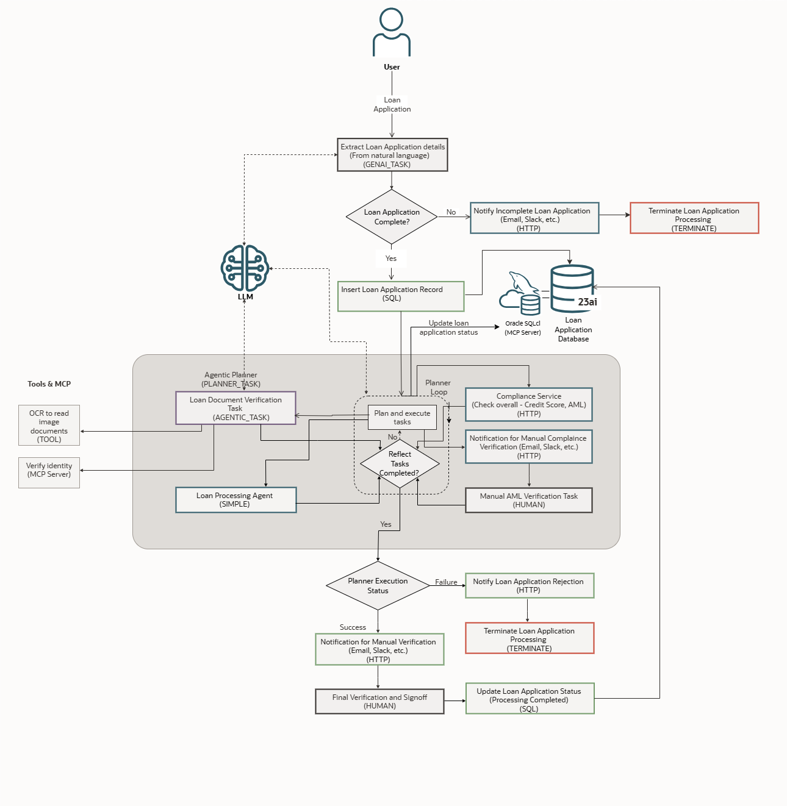

# Introduction

## About this Workshop

In this workshop, you'll dive deep into building and managing sophisticated AI-agentic workflows using JSON and orchestrated using Oracle® Transaction Manager for Microservices (MicroTx) Workflow. We'll explore a real-world loan application use case where a planner system task, powered by a large language model (LLM), dynamically orchestrates the task execution across specialized AI agents such as KYC, credit scoring, and risk evaluation agents.

You'll use JSON-based workflow models and modular Java agents to assemble these processes-from initial application intake through to approval and loan disbursement. The ability of MicroTx Workflow to coordinate distributed transactions ensures data integrity and consistency in financial operations no matter how complex the orchestration becomes.

The following diagram illustrates how an agentic workflow processes a loan application. This agentic workflow seamlessly blends automation with human oversight to ensure accurate, compliant, and efficient loan application processing.

1. Submission and data extraction: The process begins when a user submits a loan application. AI algorithms automatically extract all relevant details from the application, even if the information is provided in natural language.

2. Completeness check: The system checks whether all required information is present. If any details are missing, the applicant is immediately notified, and the process is paused pending their response.

3. Application recording: Once the application is deemed complete, it is securely recorded in the database.

4. Orchestration by agentic planner: The agentic planner takes over, orchestrating key workflow steps—such as verifying submitted documents using OCR technology and validating the applicant’s identity.

5. Compliance and review: The workflow then performs compliance checks, including evaluating the applicant’s credit score and ensuring adherence to anti-money laundering (AML) regulations. If any step requires human intervention, the planner promptly alerts the appropriate personnel for manual review.

6. Iterative processing: The planner continuously assesses and executes the necessary tasks, looping through verification and compliance checks until a final decision is reached. The final decision could be one of the following:
    * Approval: If the application passes all checks, a final manual signoff is requested. Once confirmed, the system updates the application status to approved.
    * Rejection: If any check fails, the applicant is promptly notified of the decision, and the process concludes.

Estimated Workshop Time: 1 hour 30 minutes

### Objectives

In this workshop, you will learn how to:

* Learn how to model and orchestrate agentic workflows for real-world, production-grade use cases.
* Use a planner task powered by LLMs to drive real-time, adaptive decision-making within your workflows.
* Build modular AI agent workers in Java, such as KYC Agent, Credit Scoring Agent, Risk Evaluation Agent.
* Combine AI and orchestration with MicroTx Workflow to boost flexibility, automation, and control in complex business operations.
* Configure and execute distributed transactions using MicroTx, ensuring atomicity, resiliency, and data integrity across microservices.

By the end of this LiveLab, you'll not only understand the architectural benefits and capabilities of MicroTx Workflow, but you'll have hands-on experience to define, configure, and execute AI-enhanced workflows in real-world scenarios with dynamic control flow, decision-making, and integration.

### Prerequisites

This lab assumes you have:
* An Oracle account
* At least 4 OCPUs, 24 GB memory, and 128 GB of bootable storage volume or more is available in your Oracle Cloud Infrastructure tenancy.

## Learn More

* [Oracle® Transaction Manager for Microservices Installation and Configuration Guide](https://docs.oracle.com/pls/topic/lookup?ctx=microtx-latest&id=TMMDG)

## Acknowledgements
* **Author** - Sylaja Kannan, Consulting User Assistance Developer
* **Contributors** -  Brijesh Kumar Deo and Bharath MC
* **Last Updated By/Date** - Sylaja Kannan, September 2025