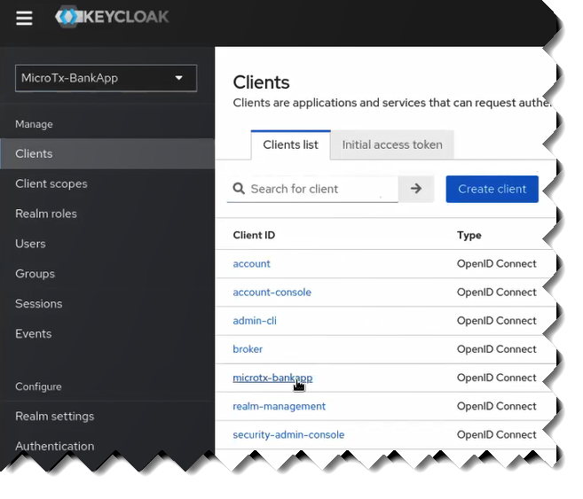
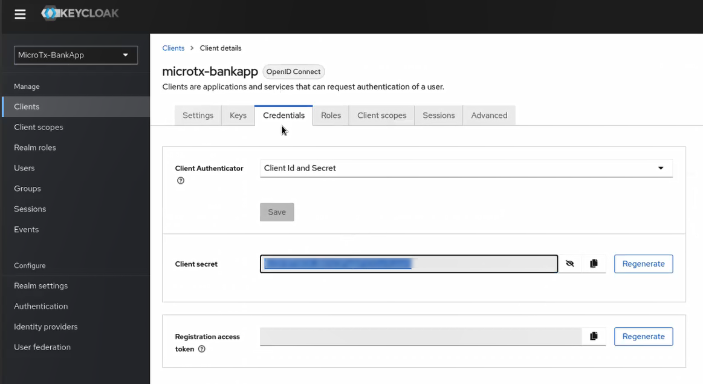

# Deploy the Bank and Stock-Trading Application

## Introduction

The Bank and Stock-Trading application contains several microservices that interact with each other to complete a transaction. The Stock Broker microservice initiates the transactions to purchase and sell shares, so it is called a transaction initiator service. The Core Banking, Branch Banking, and User Banking services participate in the transactions related to the trade in stocks, so they are called participant services.

To deploy the application, you must build each microservice as a container image and provide the deployment details in a YAML file.

Estimated Time: 12 minutes

### Objectives

In this lab, you will:

* Configure Minikube and start a Minikube tunnel
* Configure Keycloak
* Build container images for the Stock Broker microservice.
* Update the `values.yaml` file, which contains the deployment configuration details for the Bank and Stock-Trading application.
* Install the Bank and Stock-Trading application. While installing the application, Helm uses the configuration details you provide in the `values.yaml` file.
* (Optional) Deploy Kiali and Jaeger in your Minikube cluster

### Prerequisites

This lab assumes you have:

* An Oracle Cloud account.
* Successfully completed the previous labs:
    * Get Started
    * Lab 1: Prepare setup
    * Lab 2: Set Up the Environment
    * Lab 3: Integrate MicroTx Client Libraries with the Stock Broker Microservice
* Logged in using remote desktop URL as an `oracle` user. If you have connected to your instance as an `opc` user through an SSH terminal using auto-generated SSH Keys, then you must switch to the `oracle` user before proceeding with the next step.

  ```
  <copy>
  sudo su - oracle
  </copy>
  ```

## Task 1: Configure Minikube and Start a Tunnel

Before you start a transaction, you must start a Minikube tunnel.

1. Start Minikube.

    ```
    <copy>
    minikube start
    </copy>
    ```

3. Run the following command in a new terminal to start a tunnel. Keep this terminal window open.

    ```
    <copy>
    minikube tunnel
    </copy>
    ```

4. Enter the password to access your local machine if you are prompted to enter your password.

5. In a new terminal, run the following command to note down the external IP address of the Istio ingress gateway.

    ```
    <copy>
    kubectl get svc istio-ingressgateway -n istio-system
    </copy>
    ```

    From the output note down the value of `EXTERNAL-IP`, which is the external IP address of the Istio ingress gateway. You will provide this value in the next step. If the `EXTERNAL-IP` is in the `pending` state, ensure that the minikube tunnel is running before proceeding with the next steps.

    **Example output**

    

    Let's consider that the external IP in the above example is 192.0.2.117.

6. Store the external IP address of the Istio ingress gateway in an environment variable named `CLUSTER_IPADDR` as shown in the following command.

    ```
    <copy>
    export CLUSTER_IPADDR=192.0.2.117
    </copy>
    ```

    Note that, if you don't do this, then you must explicitly specify the IP address in the commands when required.

## Task 2: Configure Keycloak

The Bank and Stock-Trading Application console uses Keycloak to authenticate users.

1. Run the following command to note down the external IP address and port to access Keycloak.

    ```
    <copy>
    kubectl get svc -n keycloak
    </copy>
    ```

    From the output note down the value of `EXTERNAL-IP` and `PORT(S)`, which is the external IP address and port of Keycloak. You will provide this value in the next step.

    **Example output**

    

    Let's consider that the external IP in the above example is 198.51.100.1 and the IP address is 8080.

2. Run the following command to run the `reconfigure-keycloak.sh` script from the `$HOME` directory

    ```
    <copy>
    cd $HOME
    sh reconfigure-keycloak.sh
    </copy>
    ```

3. Sign in to Keycloak. In a browser, enter the IP address and port number that you have copied in the previous step. The following example provides sample values. Provide the values based on your environment.

    ```
    http://198.51.100.1:8080
    ```

4. Click **Administration Console**.

5. Sign in to Keycloak with the initial administrator username `admin` and password `admin`. After logging in, reset the password for the `admin` user. For information about resetting the password, see the Keycloak documentation.

6. Select the **MicroTx-BankApp** realm, and then click **Users** to view the list of users in the `MicroTx-BankApp` realm. The `MicroTx-BankApp` realm is preconfigured with these default user names.
   

7. Set the password for each user. For information about providing credentials for users, see the Keycloak documentation.

8. Click **Clients**, and then click **microtx-bankapp** in the **Clients list** tab.
    

    Details of the `microtx-bankapp` client are displayed.

9. In the **Settings** tab, under **Access settings**, verify that the external IP address of Istio ingress gateway is available in the **Root URL**, **Valid redirect URIs**, **Valid post logout redirect URIs**, and **Admin URL** fields.

10. Click the **Credentials** tab, and then note down the value of the **Client-secret**. You'll need to provide this value later.
    

11. Click **Realm settings**, and then in the **Frontend URL** field of the **General** tab, verify that the values provided match the external IP address and port of the Keycloak server which you have copied in a previous step. For example, `http://198.51.100.1:8080`.

12. In the **Endpoints** field, click the **OpenID Endpoint Configuration** link. Configuration details are displayed in a new tab.

13. Note down the value of the **issuer** URL. It is in the format, `http://<keycloak-ip-address>:<port>/realms/<name-of-realm-you-have-created>`. For example, `http://198.51.100.1:8080/realms/MicroTx-Bankapp`. You'll need to provide this value later.

14. Click **Save**.

## Task 3: Provide Access Details in the values.yaml File

The folder that contains the Bank and Stock-Trading application code also contains the `values.yaml` file. This is the manifest file, which contains the deployment configuration details for the Bank and Stock-Trading application. Edit the `values.yaml` file to provide the URL to access Keycloak and other access details.

To provide the configuration and environment details in the `values.yaml` file:

1. Open the `values.yaml` file, which is in the `/home/oracle/microtx/otmm-23.4.1/samples/xa/java/bankapp/Helmcharts` folder.

2. Enter values that you have noted down for the following fields under `security` in `UserBanking`.

    * `clientSecret`: Enter the value of the client secret value that you had copied in step 10 of [Task 2](#Task2:ConfigureKeycloak).
    * `issuerURL`: Enter the URL that you had copied in step 13 of [Task 2](#Task2:ConfigureKeycloak).
    * `logoutRedirectURL`: Enter the URL in the format, `http://$CLUSTER_IPADDR/bankapp`. Where, `CLUSTER_IPADDR` is the external IP address of the Istio ingress gateway that you have noted down in [Task 1](#Task1:ConfigureMinikubeandStartaTunnel). For example, `http://192.0.2.117/bankapp`.

3. Under `StockBroker`, set `deploymentEnabled` to `true`. You must set this flag to true before deploying the Stock Broker service.

4. Save the changes you have made to the `values.yaml` file.

## Task 4: Build Container Images for Each Microservice

The code for the Bank and Stock-Trading application is available in the installation bundle in the `/home/oracle/microtx/otmm-23.4.1/samples/xa/java/bankapp` folder. The container image for the User Banking, Branch Banking, Core Banking services are pre-built and available for your use. Build the container image only for the Stock Broker service.

To build container image for the Stock Broker service:

1. Run the following commands to build the Docker image for the Stock Broker service.

    ```
    <copy>
    cd /home/oracle/microtx/otmm-23.4.1/samples/xa/java/bankapp/StockBroker
    </copy>
    ```

    ```
    <copy>
    minikube image build -t stockbroker:1.0 .
    </copy>
    ```

   When the image is successfully built, the following message is displayed.

   **Successfully tagged stockbroker:1.0**

The container image that you have built is available in your Minikube container registry.

## Task 5: Install the Bank and Stock-Trading application

Install the Bank and Stock-Trading application in the `otmm` namespace, where you have installed MicroTx. While installing the Bank and Stock-Trading application, Helm uses the configuration details you have provided in the `values.yaml` file.

1. Run the following commands to install the Bank and Stock-Trading application.

    ```
    <copy>
    cd /home/oracle/microtx/otmm-23.4.1/samples/xa/java/bankapp/Helmcharts
    </copy>
    ```

    ```
    <copy>
    helm install bankapp --namespace otmm bankapp/ --values bankapp/values.yaml
    </copy>
    ```

   Where, `bankapp` is the name of the application that you want to install. You can provide another name to the installed application.

   In the output, verify that the `STATUS` of the `bankapp` is `deployed`.

   **Example output**

    ```
    NAME: bankapp
    LAST DEPLOYED: Tue May 23 10:52:14 2023
    NAMESPACE: otmm
    STATUS: deployed
    REVISION: 1
    TEST SUITE: None
    ```

2. If you don't need to make any changes to the `values.yaml` file, skip this step and go to the next step. If you need to modify the `values.yaml` file, then uninstall `bankapp`.

    ```
    <copy>
    helm uninstall bankapp --namespace otmm
    </copy>
    ```

    Update the `values.yaml` file, and then reinstall `bankapp`. Perform step 1 as described in this task again to reinstall `bankapp`.

3. Verify that all resources, such as pods and services, are ready. Proceed to the next step only when all resources are running. Run the following command to retrieve the list of resources in the namespace `otmm` and their status.

    ```
    <copy>
    kubectl get pods -n otmm
    </copy>
    ```

    The following image shows a sample output.
   

## Task 6: Deploy Kiali and Jaeger (Optional)

Optionally, you can use Kiali and Jaeger to track and trace distributed transactions in MicroTx through visualization. Use distributed tracing to track how requests flow between MicroTx and the microservices.

Run the following commands to deploy Kiali and Jaeger in a Minikube cluster.

1. Deploy Kiali.

    ```
    <copy>
    kubectl apply -f https://raw.githubusercontent.com/istio/istio/release-1.17/samples/addons/kiali.yaml
    </copy>
    ```

2. Deploy Prometheus. To use Kiali, you must deploy Prometheus and Kiali in the same cluster.

    ```
    <copy>
    kubectl apply -f https://raw.githubusercontent.com/istio/istio/release-1.17/samples/addons/prometheus.yaml
    </copy>
    ```

3. Deploy Jaeger.

    ```
    <copy>
    kubectl apply -f https://raw.githubusercontent.com/istio/istio/release-1.17/samples/addons/jaeger.yaml
    </copy>
    ```

4. Start the Kiali Dashboard. Run the following command in a new terminal. Ensure that you leave this terminal open. If a new browser opens, close the browser.

    ```
    <copy>
    istioctl dashboard kiali
    </copy>
    ```

   From the output, note down the URL. This is the URL on which you can access the Kiali dashboard in a browser. For example, `http://localhost:20001/kiali`.

5. Start the Jaeger Dashboard. Run the following command in a new terminal. Ensure that you leave this terminal open. If a new browser opens, close the browser.

    ```
    <copy>
    istioctl dashboard jaeger
    </copy>
    ```

   From the output, note down the URL. This is the URL on which you can access the Jaeger dashboard in a browser. For example, `http://localhost:16686`.

You may now **proceed to the next lab**.

## Learn More

* [Develop Applications with XA](http://docs.oracle.com/en/database/oracle/transaction-manager-for-microservices/23.4.1/tmmdg/develop-xa-applications.html#GUID-D9681E76-3F37-4AC0-8914-F27B030A93F5)

## Acknowledgements

* **Author** - Sylaja Kannan
* **Contributors** - Brijesh Kumar Deo and Bharath MC
* **Last Updated By/Date** - Sylaja, November 2023
